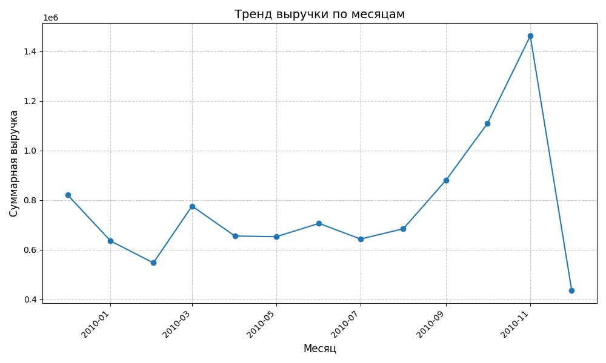
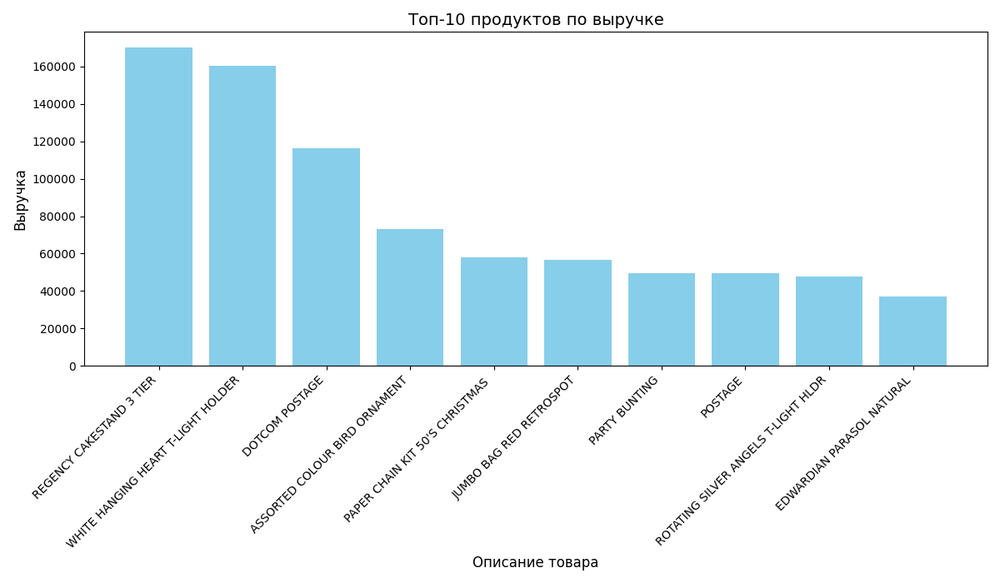
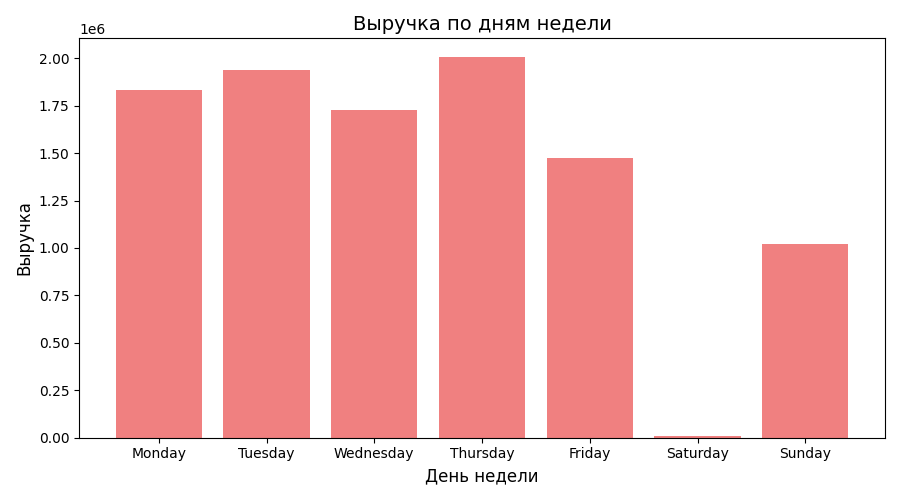
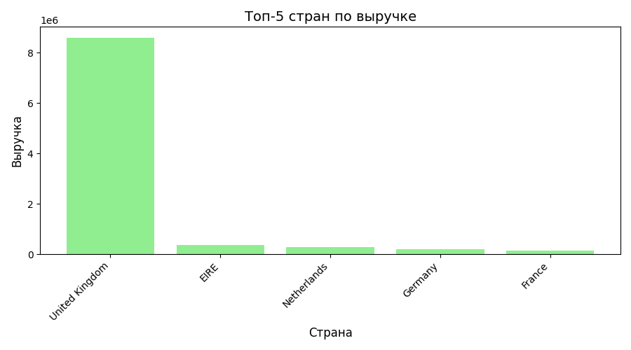

# Sale_Analytics_Project
Анализ данных о продажах онлайн-ритейлера за 2009-2010 годы
[](https://colab.research.google.com/github/khan-MR/Sale_Analytics_Project/blob/main/Sale_analytics.ipynb)

## Содержание
- [Набор данных](#набор-данных)
- [Цели проекта](#цели-проекта)
- [Используемые инструменты](#используемые-инструменты)
- [Основные шаги анализа](#основные-шаги-анализа)
- [Ключевые результаты и выводы](#ключевые-результаты-и-выводы)
- [Как запустить проект](#как-запустить-проект)
- [Будущие улучшения](#будущие-улучшения)
- [Контакты](#контакты)

- ## Набор данных
Используется набор данных "Online Retail" (Kaggle), содержащий транзакционные данные за период с 01.12.2009 по 09.12.2011 для онлайн-магазина, зарегистрированного в Великобритании.
Он включает следующие поля:
- `InvoiceNo`: Номер счета. Уникальный идентификатор каждой транзакции.
- `StockCode`: Код товара. Уникальный идентификатор каждого продукта.
- `Description`: Название товара.
- `Quantity`: Количество товара в транзакции.
- `InvoiceDate`: Дата и время выставления счета.
- `UnitPrice`: Цена за единицу товара.
- `CustomerID`: Идентификатор клиента.
- `Country`: Страна, в которой проживает клиент.

## Цели проекта
* **Очистка и предобработка данных**: Работа с пропусками, некорректными значениями, дубликатами.
* **Исследовательский анализ данных (EDA)**: Выявление паттернов, аномалий и зависимостей.
* **Расчет ключевых метрик продаж**: Общий доход, средний чек, количество транзакций.
* **Анализ временных рядов**: Изучение тенденций продаж по месяцам, дням недели.
* **Анализ продуктового портфеля**: Выявление самых продаваемых и прибыльных товаров.
* **Географический анализ**: Определение стран с наибольшим доходом.
* **Визуализация данных**: Представление результатов в наглядной форме.

## Используемые инструменты
* **Язык программирования**: Python
* **Библиотеки Python**:
    * `pandas` для манипуляции и анализа данных
    * `numpy` для численных операций
    * `matplotlib` и `seaborn` для визуализации данных
* **Среда разработки**: Google Colab
* **Управление версиями**: Git, GitHub

## Основные шаги анализа
1.  **Загрузка и первичное ознакомление**: Загрузка CSV-файла, обзор структуры данных, типов данных и пропущенных значений.
2.  **Очистка данных**:
    * Удаление дубликатов.
    * Обработка пропущенных значений (например, `Description`, `CustomerID`).
    * Корректировка некорректных значений (например, отрицательные количества).
    * Преобразование типов данных.
3.  **Создание производных признаков**: Расчет общего дохода по каждой строке (`TotalPrice`).
4.  **Анализ продаж по времени**:
    * Тенденции ежемесячного дохода.
    * Доход по дням недели.
5.  **Анализ продуктового портфеля**:
    * Топ-10 продуктов по доходу.
    * Топ-10 продуктов по количеству.
6.  **Географический анализ**:
    * Топ-5 стран по доходу.
7.  **Сохранение очищенных данных**: Сохранение обработанных данных в форматах CSV и Parquet для дальнейшего использования.

   ## Ключевые результаты и выводы

### 1. Ежемесячная динамика дохода
* Наблюдается стабильный рост выручки с пиком в ноябре каждого года, что может быть связано с предновогодними распродажами.
* Декабрьские продажи значительно ниже ноябрьских, возможно, из-за окончания сезона праздничных покупок или неполных данных за декабрь 2011 года.

**Визуализация:**


### 2. Топ-10 товаров по доходу
* Определены ключевые товары, приносящие наибольший доход, что позволяет сосредоточить маркетинговые усилия и управление запасами на этих позициях. Например, `REGENCY CAKESTAND 3 TIER` является лидером по выручке.

**Визуализация:**


### 3. Доход по дням недели
* Наибольший объем продаж приходится на вторник и четверг, тогда как в субботу продажи отсутствуют, что указывает на отсутствие работы магазина в этот день.
* Понедельник демонстрирует стабильно хороший уровень продаж.

**Визуализация:**

### 4. Доход по странам
* Великобритания является основным рынком, генерирующим подавляющую часть дохода.
* Среди других стран выделяются Ирландия, Нидерланды, Германия и Франция.

**Визуализация:**


## Как запустить проект
1.  **Клонировать репозиторий**:
    ```bash
    git clone [https://github.com/khan-MR/Sale_Analytics_Project.git](https://github.com/khan-MR/Sale_Analytics_Project.git)
    ```
2.  **Открыть в Google Colab**:
    * Перейдите по ссылке [](https://colab.research.google.com/github/khan-MR/Sale_Analytics_Project/blob/main/Sale_analytics.ipynb).
    * Или откройте `Sale_analytics.ipynb` непосредственно из клонированной папки в Colab (`File -> Open notebook -> GitHub` или `File -> Open notebook -> Upload` если вы скачали репозиторий).
3.  **Выполнить все ячейки**: Запустите все ячейки в блокноте последовательно. Код включает этапы загрузки данных, очистки, анализа и визуализации.
    * **Примечание:** Для успешного выполнения Git-операций и использования данных, убедитесь, что ваш Colab-ноутбук открыт из папки `Sale_Analytics_Project` (после клонирования).
  
## Будущие улучшения
* **Сегментация клиентов**: Использование RFM-анализа для сегментации клиентов.
* **Прогнозирование продаж**: Построение моделей для прогнозирования будущих продаж.
* **Анализ корзин покупок**: Выявление часто покупаемых вместе товаров (Market Basket Analysis).
* **Дашборд**: Создание интерактивного дашборда (например, с использованием Streamlit, Dash или Power BI) для визуализации ключевых метрик.

## Контакты
Автор проекта: [khan-MR]
GitHub: [https://github.com/khan-MR](https://github.com/khan-MR)
